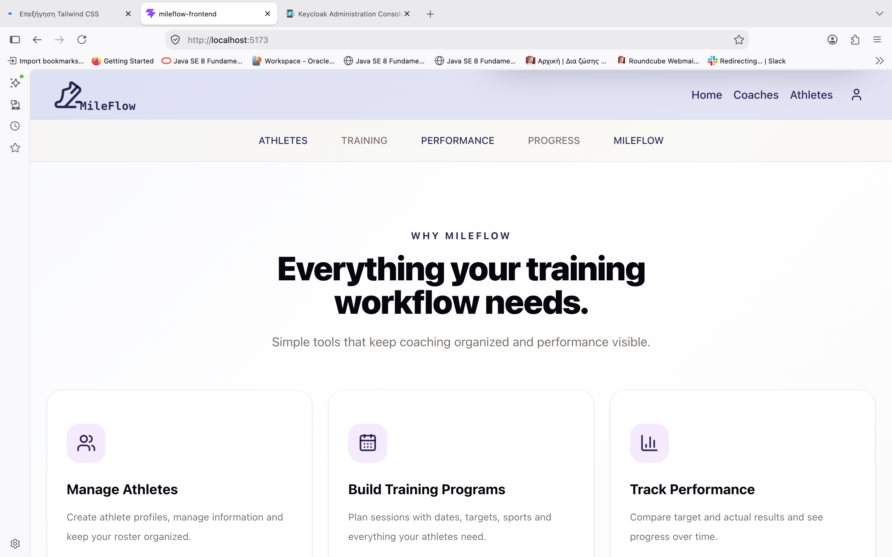
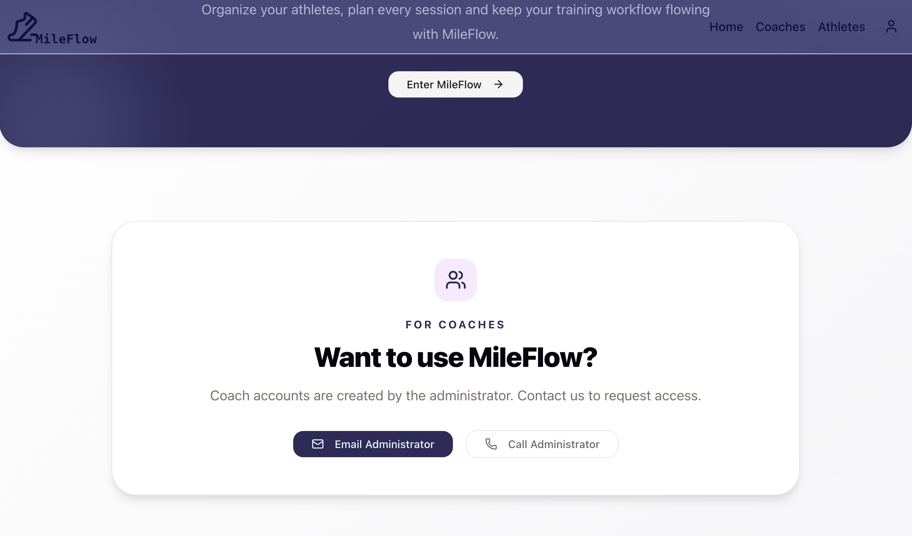
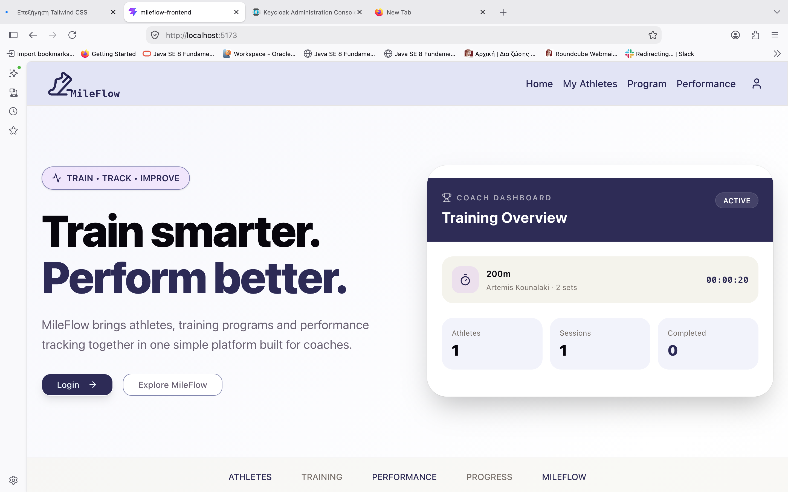
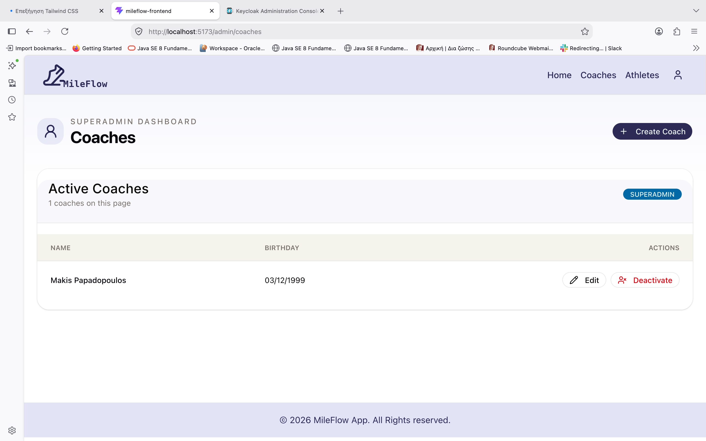
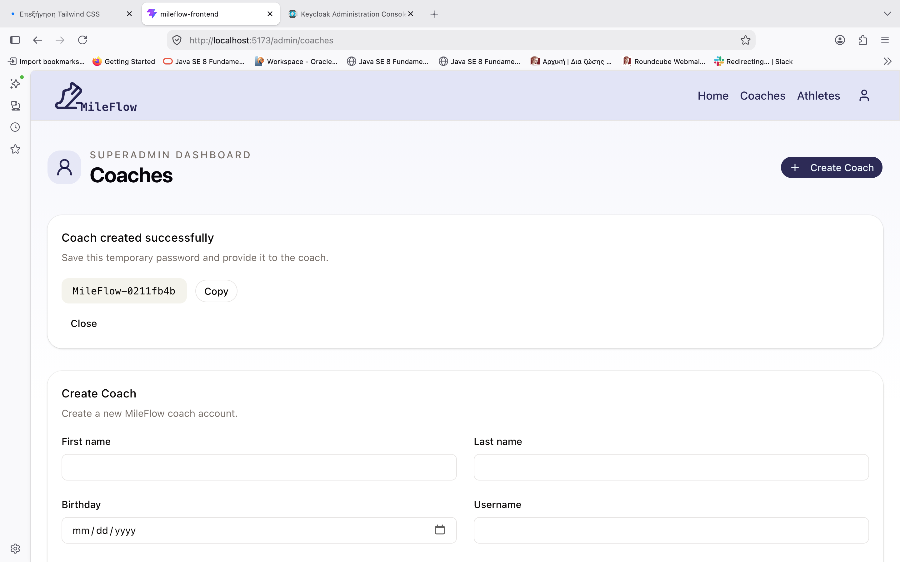
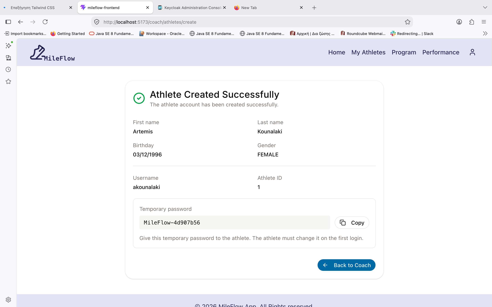
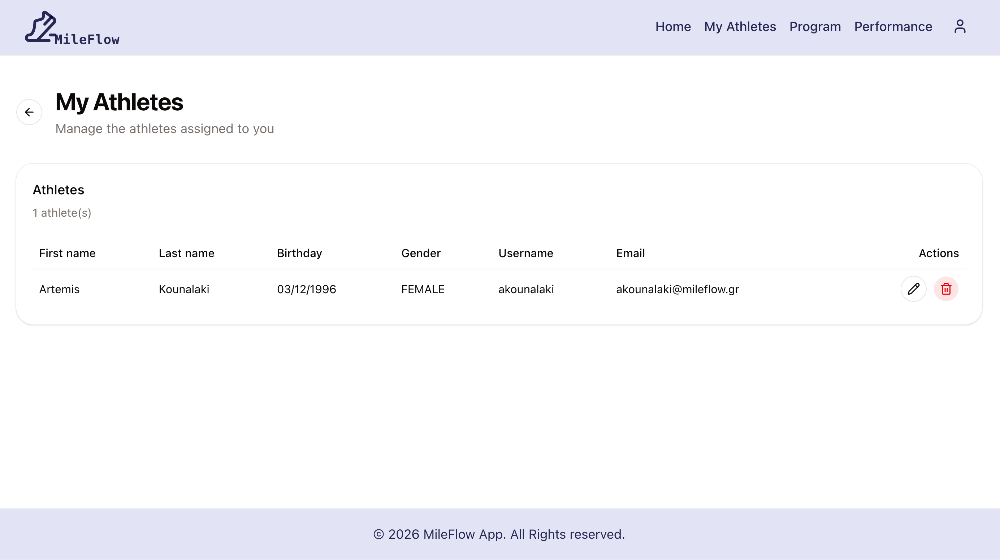
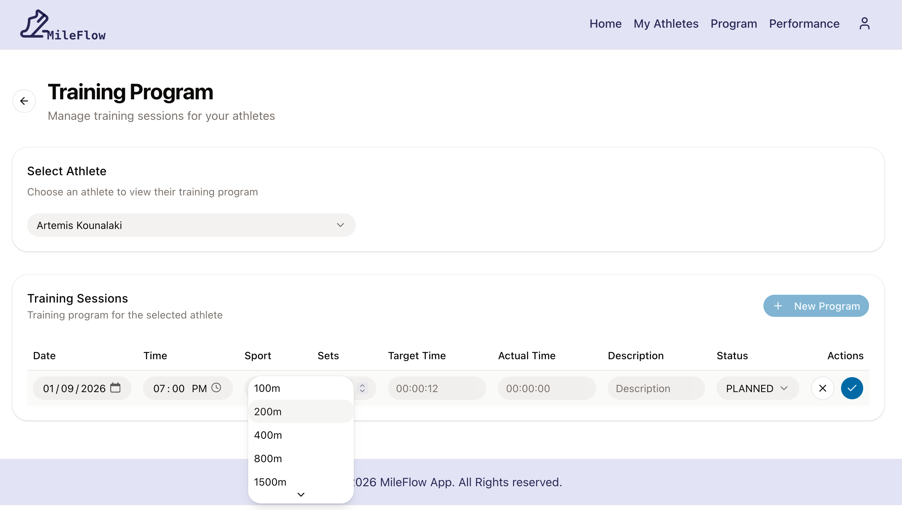
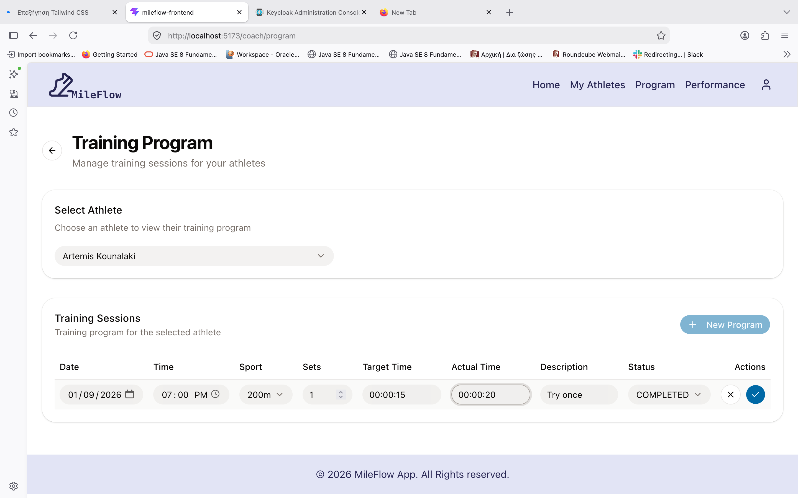
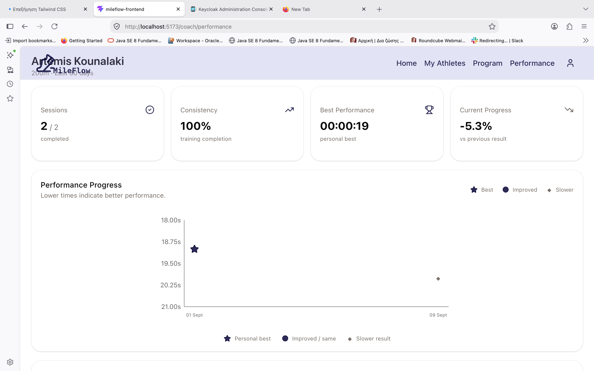

# MileFlow

MileFlow is a full-stack web application developed as the **final project of the Coding Factory program at the Athens University of Economics and Business (AUEB)**.

The application is designed for managing track & field training programs, coaches, athletes, training sessions, and performance data through a centralized platform.

MileFlow was developed as a full-stack application, combining modern frontend development, REST API design, relational database management, authentication and authorization, and containerized application deployment.

The project demonstrates the integration of **Java, Spring Boot, React, MySQL, Keycloak, Docker, and RESTful services** into a complete web application.

---

## Table of Contents

* [Overview](#overview)
* [Main Features](#main-features)
* [User Roles](#user-roles)
* [How MileFlow Can Be Used](#how-mileflow-can-be-used)
* [Application Workflow](#application-workflow)
* [Technology Stack](#technology-stack)
* [Architecture](#architecture)
* [Authentication and Authorization](#authentication-and-authorization)
* [Database](#database)
* [Project Structure](#project-structure)
* [Running the Application with Docker](#running-the-application-with-docker)
* [Application URLs](#application-urls)
* [Using the Application](#using-the-application)
* [REST API and Swagger](#rest-api-and-swagger)
* [Screenshots](#screenshots)
* [Development](#development)
* [Stopping the Application](#stopping-the-application)
* [Future Improvements](#future-improvements)
* [Author](#author)

---

# Overview

MileFlow is intended to support the daily workflow of a track & field training environment.

Instead of managing athletes, training schedules, and performance information through spreadsheets, notebooks, or separate applications, MileFlow provides a centralized system where:

* administrators manage coaches,
* coaches manage their athletes,
* coaches create and manage training programs,
* athletes can access their own training information,
* training sessions can be recorded and updated,
* athlete performance can be monitored over time.

The application follows a **role-based architecture**, ensuring that users only have access to the functionality associated with their role.

---

# Main Features

### User Management

* User authentication through Keycloak
* Role-based access control
* User profile management
* Secure JWT-based authentication

### Coach Management

* Create coaches
* View coaches
* Update coach information
* Delete coaches
* Manage coach profiles

### Athlete Management

* Register athletes
* View athlete information
* Update athlete information
* Delete athletes
* Associate athletes with sports
* View an athlete's profile

### Training Management

* Create training sessions
* Assign training sessions to athletes
* Assign sports to training sessions
* Define number of sets
* Define target time
* Record actual performance time
* Set training dates
* Update training sessions
* Delete training sessions
* View today's training schedule
* View training history

### Performance Tracking

* View athlete performance
* View personal performance
* Track target versus actual training times
* Display performance information in a structured way
* Visualize performance data through charts

### Sports

* View available sports
* Associate athletes with sports
* Use sports when creating training sessions

### API Documentation

* RESTful API
* OpenAPI documentation
* Swagger UI
* Documented endpoints, request bodies and responses

---

# User Roles

MileFlow supports three main roles:

| Role           | Main Responsibility                                 |
| -------------- | --------------------------------------------------- |
| **Superadmin** | Manages coaches and has administrative access       |
| **Coach**      | Manages athletes and training programs              |
| **Athlete**    | Views personal training and performance information |

---

## Superadmin

The Superadmin is responsible for the administration of the platform.

A Superadmin can:

* log into the application,
* view the coach list,
* create new coaches,
* update coaches,
* delete coaches,
* view registered athletes.

The initial Superadmin account is automatically created when the application starts for the first time.

### Default credentials

```text
Username: admin
Password: admin
```

> These credentials are intended for the initial/demo environment and should be changed or replaced in a production deployment.

---

## Coach

The Coach is the main operational user of MileFlow.

A coach can:

* access their dashboard,
* manage their profile,
* register athletes,
* view athletes,
* update athlete information,
* remove athletes,
* create training programs,
* assign training sessions to athletes,
* define target training times,
* record actual training times,
* update or delete training sessions,
* view today's training schedule,
* view athlete performance,
* monitor athlete progress.

The Coach dashboard provides a central place for the coach to see important information about their athletes and scheduled training.

---

## Athlete

The Athlete has access to their own training and performance information.

An athlete can:

* log into the application,
* view their personal profile,
* view their assigned training sessions,
* view their training history,
* view their performance information,
* monitor their progress over time.

Athletes do not have access to administrative functionality or to manage other athletes.

---

# How MileFlow Can Be Used

MileFlow can be used as a digital management system for a track & field coach, athlete, training group, or sports organization.

A typical use case could be the following:

### 1. The Superadmin sets up the platform

The Superadmin logs into MileFlow and creates the coaches who will use the platform.

For example:

```text
Superadmin
    ↓
Creates Coach
    ↓
Coach receives account
```

---

### 2. The Coach manages their athletes

After logging in, the Coach can register the athletes they train.

For every athlete, the coach can maintain information such as:

* first name,
* last name,
* date of birth,
* gender,
* sport.

This creates a centralized athlete database for the coach.

---

### 3. The Coach creates training sessions

The coach can create training sessions for their athletes.

A training session can contain information such as:

* athlete,
* sport,
* number of sets,
* target time,
* actual time,
* training date.

For example:

```text
Athlete: Maria Papadopoulou
Sport: 400m
Sets: 6
Target Time: 01:05
Actual Time: 01:07
Date: 2026-09-08
```

The coach can then update the session when the athlete completes the training.

---

### 4. The Athlete follows their training

The athlete logs into MileFlow and can see the training sessions assigned to them.

This allows the athlete to use the platform as a personal training reference instead of relying on paper schedules or messages.

---

### 5. Training performance is recorded

After a training session, the coach can record the athlete's actual performance.

The system can therefore maintain information such as:

```text
Target Time
     ↓
Training Session
     ↓
Actual Time
     ↓
Performance History
```

This allows the coach to compare planned training targets with actual results.

---

### 6. Performance can be monitored over time

The stored training information can be used to monitor athlete performance.

The Coach can view an athlete's performance, while the Athlete can view their own performance information.

This makes MileFlow useful not only for scheduling training but also for maintaining a historical record of an athlete's development.

---

# Application Workflow

The main workflow of the application is:

```text
                     ┌───────────────┐
                     │   Superadmin  │
                     └───────┬───────┘
                             │
                       Creates Coaches
                             │
                             ▼
                     ┌───────────────┐
                     │     Coach     │
                     └───────┬───────┘
                             │
                    Registers Athletes
                             │
                             ▼
                    Creates Training
                       Programs
                             │
                             ▼
                    ┌───────────────┐
                    │    Athlete    │
                    └───────┬───────┘
                             │
                    Views Training
                    & Performance
                             │
                             ▼
                    Performance Data
```

This workflow reflects the main purpose of the application: **administration → athlete management → training management → performance monitoring**.

---

# Technology Stack

## Backend

* **Java 21**
* **Spring Boot 4.0.7**
* Spring Web MVC
* Spring Data JPA
* Hibernate
* Spring Security
* OAuth2 Resource Server
* Jakarta Validation
* Keycloak Admin Client
* Flyway
* MySQL Connector
* Gradle
* SpringDoc OpenAPI / Swagger

The backend dependencies and Java version are defined in the project's Gradle configuration.

---

## Frontend

* **React 19**
* **TypeScript**
* **Vite**
* React Router
* Axios
* Tailwind CSS
* shadcn/ui
* Keycloak JS
* Recharts
* Lucide React

The frontend is implemented as a separate React application and uses Vite for development and production builds.

---

## Infrastructure

* Docker
* Docker Compose
* MySQL 8
* Keycloak
* Nginx

---

# Architecture

MileFlow follows a client-server architecture.

```text
┌───────────────────────────┐
│        React Frontend     │
│                           │
│  TypeScript + Vite        │
│  Tailwind + shadcn/ui     │
└─────────────┬─────────────┘
              │
              │ REST / HTTP
              ▼
┌───────────────────────────┐
│       Spring Boot API     │
│                           │
│  Controllers              │
│  Services                 │
│  Repositories             │
│  Security                 │
│  DTOs                     │
└───────┬───────────┬───────┘
        │           │
        │           │
        ▼           ▼
┌────────────┐  ┌───────────────┐
│   MySQL    │  │   Keycloak    │
│  Database  │  │ Authentication│
└────────────┘  │ & Authorization│
                └───────────────┘
```

The frontend communicates with the Spring Boot REST API, while the backend communicates with MySQL for persistent application data and Keycloak for authentication and authorization.

---

# Authentication and Authorization

MileFlow uses **Keycloak** for authentication and role-based authorization.

The application uses JWT bearer tokens when communicating with protected backend endpoints.

The main roles are:

```text
SUPERADMIN
COACH
ATHLETE
```

The backend uses Spring Security as an OAuth2 Resource Server and validates JWT tokens issued by Keycloak.

Keycloak is also used by the backend through the Keycloak Admin Client for user administration.

---

# Database

MileFlow uses **MySQL 8** as its relational database.

The backend uses:

* Spring Data JPA
* Hibernate
* Flyway migrations

The database stores information related to:

* users,
* coaches,
* athletes,
* sports,
* training sessions,
* athlete/sport relationships,
* performance information.

Flyway is responsible for database schema migrations, while JPA/Hibernate provides the object-relational mapping between Java entities and database tables.

---

# Project Structure

The repository is organized into separate frontend and backend applications:

```text
mileflow/
│
├── backend/
│   ├── src/
│   │   ├── main/
│   │   └── test/
│   ├── build.gradle
│   ├── gradlew
│   ├── Dockerfile
│   └── ...
│
├── frontend/
│   ├── src/
│   ├── public/
│   ├── package.json
│   ├── vite.config.ts
│   ├── Dockerfile
│   ├── nginx.conf
│   └── ...
│
├── keycloak/
│
├── screenshots/
│
├── docker-compose.yml
├── .env.example
└── README.md
```

---

# Running the Application with Docker

Docker is the recommended way to run the complete MileFlow environment.

## Prerequisites

Make sure the following are installed:

* Docker Desktop
* Git

No separate installation of MySQL, Keycloak, or Nginx is required when using the provided Docker Compose setup.

---

## 1. Clone the repository

```bash
git clone https://github.com/Artemis-Kounalaki/mileflow.git
cd mileflow
```

---

## 2. Create the environment file

Copy the example environment file:

```bash
cp .env.example .env
```

Review the values in `.env` before starting the application.

> Never commit the real `.env` file or production credentials to Git.

---

## 3. Start the application

Run:

```bash
docker compose up --build
```

Docker Compose starts the required services for the application.

The first build may take several minutes because the backend and frontend Docker images are built.

---

## 4. Open MileFlow

Once the containers are running, open:

```text
http://localhost:5173
```

The frontend provides the main MileFlow user interface.

---

# Application URLs

| Service               | URL                                           |
| --------------------- | --------------------------------------------- |
| MileFlow Frontend     | `http://localhost:5173`                       |
| Spring Boot Backend   | `http://localhost:8080`                       |
| Swagger UI            | `http://localhost:8080/swagger-ui/index.html` |
| OpenAPI Specification | `http://localhost:8080/v3/api-docs`           |
| Keycloak              | `http://localhost:8081`                       |
| MySQL                 | `localhost:3306`                              |

---

# Using the Application

## First Login

After starting the application with Docker, the initial Superadmin account is automatically prepared.

Use:

```text
Username: admin
Password: admin
```

After logging in as Superadmin, the administrator can begin configuring the application.

---

## Superadmin Workflow

### Step 1 — Login

Log in using the Superadmin account.

### Step 2 — Create a Coach

Navigate to the coach management section and create a coach account.

### Step 3 — Manage Coaches

The Superadmin can view the registered coaches and update or remove them when necessary.

### Step 4 — View Athletes

The Superadmin can also access the athlete list.

---

## Coach Workflow

### Step 1 — Login

Log in using the coach account created by the Superadmin.

### Step 2 — Open the Coach Dashboard

The dashboard provides an overview of the coach's training activity.

### Step 3 — Register an Athlete

Create an athlete profile and provide the required athlete information.

### Step 4 — View Athletes

The coach can access the athlete list and select an athlete to view their information.

### Step 5 — Create a Training Program

Create training sessions for an athlete by specifying the relevant training information.

### Step 6 — Monitor Today's Training

The coach can view the training sessions scheduled for the current day.

### Step 7 — Record Performance

After training, the coach can update the session with the athlete's actual performance.

### Step 8 — Review Performance

The coach can access the athlete's performance information and monitor progress.

---

## Athlete Workflow

### Step 1 — Login

The athlete logs into MileFlow using their account.

### Step 2 — View Profile

The athlete can access their own profile information.

### Step 3 — View Training

The athlete can see the training sessions assigned to them.

### Step 4 — View Performance

The athlete can access their own performance information and training history.

This gives the athlete a centralized view of their training activity and progress.

---

# REST API and Swagger

MileFlow exposes its backend functionality through a REST API.

The API is organized into logical resources, including:

* Users
* Coaches
* Athletes
* Sports
* Training Sessions
* Performance
* Administration

The API is documented using **OpenAPI / Swagger**.

## Swagger UI

After starting the backend, Swagger UI is available at:

```text
http://localhost:8080/swagger-ui/index.html
```

The Swagger interface provides:

* available endpoints,
* endpoint descriptions,
* request parameters,
* request bodies,
* response codes,
* DTO schemas,
* authentication support.

Protected endpoints require a valid Bearer JWT.

---

# Screenshots

## Home





---

## Coach Dashboard



---

## Coach Management





---

## Athlete Management





---

## Training Management





---

## Athlete Performance



---

# Development

The project can also be developed without Docker by running the frontend and backend separately.

## Backend

The backend is a Gradle-based Spring Boot application.

From the `backend` directory:

```bash
./gradlew bootRun
```

For a production-style build:

```bash
./gradlew bootJar
```

---

## Frontend

From the `frontend` directory:

```bash
npm install
npm run dev
```

The Vite development server runs the frontend application locally.

---

# Stopping the Application

To stop the Docker environment:

```bash
docker compose down
```

To stop the containers and remove the associated volumes:

```bash
docker compose down -v
```

> Use `docker compose down -v` carefully because removing volumes also removes persisted database data.

---

# Future Improvements

MileFlow provides the core functionality required for managing athletes and training, but the platform could be extended further.

Possible future improvements include:

* advanced performance analytics,
* additional track & field disciplines,
* customizable training templates,
* notifications and reminders,
* athlete progress reports,
* export of training and performance data,
* calendar integration,
* richer coach dashboards,
* mobile application support,
* additional athlete statistics,
* production deployment and cloud infrastructure.

---

# Author

**Artemis Kounalaki**

MileFlow was developed as a full-stack application combining modern frontend development, REST API design, relational database management, authentication, authorization, and containerized application deployment.
